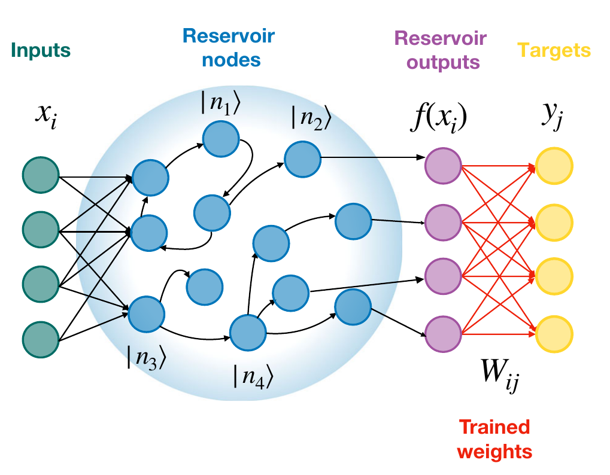
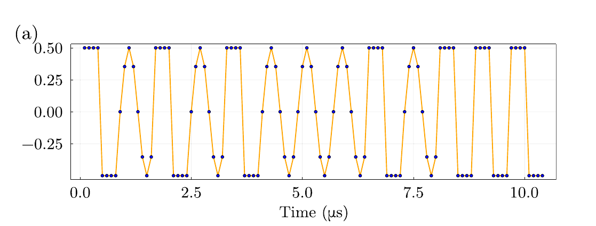
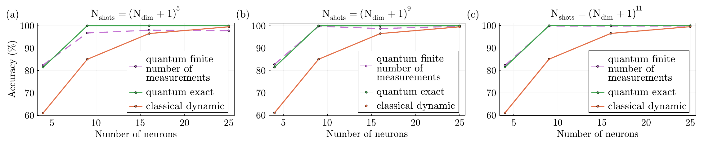

**Tags:** #Physics #Reservoir_Computing #Neural_Networks #Machine_Learning #Thesis #Quantum_RC #Quantum_Computing

This is a notes and readme page for the paper reproduction. The DOI for the paper is: https://doi.org/10.1038/s41534-023-00734-4

# Introduction
System of N qubits = $2^n$ neurons. Potential problem is to realize a large number of qubits. We can use quantum oscillators with 9 states to have a state space of 81 neurons.

## Q-RC

**The role of the reservoir is to project the inputs into a highly dimensional state space where the data becomes linearly separable.**  
The neurons are the basis states of the coupled quantum system, and the reservoir outputs are measured occupation probabilities of these states.

## RC history
- Classical RC is implemented on several systems, e.g., silicon photonics and optoelectronics to spintronic nano-oscillators.
- Quantum RC was proposed in 2017, with reservoirs whose neurons were basis states of a set of qubits.

### Coupled quantum oscillator

This is a Hamiltonian of the coupled oscillator:
$$
\hat{H} = \hbar\omega_{a}\hat{a}^{\dagger} \hat{a} + \hbar\omega_{b}\hat{b}^{\dagger} \hat{b} + \hbar g(\hat{a}\hat{b}^{\dagger} + \hat{a}^{\dagger}\hat{b})
$$
First term is the energy of oscillator $a$ and the term $\hat{a}^{\dagger}\hat{ a}$ is the excitation number operator. Same for the second term. The last term is the coupling term and a coupling constant $g$.

A harmonic oscillator with a potential,
$$
V(x) = \frac{1}{2} m\omega^2x^2
$$
has energy levels,
$$
E(n) = \hbar \omega \left(n + \frac{1}{2} \right)
$$
The energy levels are infinite in a single oscillator. A coupled oscillator can also have infinite energy states.

### Learning tasks with the quantum reservoir

There were two benchmark tests used to see how viable QRC is:

#### 1. Classification task: requires a lot of non-linearity and short-term memory

The task is to classify the points belonging to the sine and square waveform. The input data is sent as a time-series of 100, randomly arranged sine and square waveform, each discretized in 8 points. 8 points of sine wave and 8 of square wave randomly arranged.

The output is binary: 0 if the classification is not on the square and 1 if the classification is on the sine.

The oscillator is driven for $100\,\mathrm{ns}$. The **drive** mathematically is, $\ket{\psi} \propto \mathbf{D}(\alpha)\ket{\psi}$. $\mathbf{D}$ is a displacement operator on the oscillator and it makes the oscillator change states.

The result is remarkable and has $99.7\%$ accuracy with 16 measured nodes. To achieve similar performance with a classical feed-forward network (classical neurons) we will need at least 40 nodes, and with RC (dynamical classical neurons) at least 24 nodes. With 9 quantum dynamical neurons, results in $99\%$ accuracy.

Even in the classical limit of large dephasing—regime when decoherence ruins the superposition and entanglement—the model still performs better than the classical spintronic oscillator. This suggests that quantum coherence is very important. Better performance is attributed to the transformation of the inputs with unmeasured basis states.

Experimentally, the quantum measurements must be performed multiple times to get the probability amplitude. The states would be measured by coupling a qubit to each resonator and using dispersive readout. The readout is measured multiple times to reduce the statistical error. The variance of the probability amplitude of occupation states is given by,
$$
\braket{p} = \sqrt{ \frac{p(1 - p)}{N_{\text{shots}}} }
$$
For higher occupation states, more $N_{\text{shots}}$ are required. It scales with,
$$
N_{\text{shots}} = (N_{\text{dim}} + 1)^{k}
$$
$k$ is dependent on the task.

For first two levels of oscillator, $\ket{11}$, $k = 5$ and for $\ket{22}$, $k = 9$; for higher states $k = 11$ is required for more states.  
Each measurement disrupts the quantum system, therefore the sequence of the input must be replayed back after each measurement. Some studies have confirmed that reservoir can effectively learn even with weak measurements, which will reduce the experiment times.

#### 2. Prediction tasks: Requires LSTM (Long-short term memory)

Uses Mackey-Glass equation for prediction. The Mackey-Glass equation is a delay differential equation used to model the dynamics of certain biological and physiological systems, particularly in relation to cellular processes and feedback mechanisms. It is a generalization of the logistic equation and includes a time delay component that makes it capable of exhibiting complex, chaotic behavior. The equation reads,
$$
\frac{dx(t)}{dt} = \beta\frac{x(t-\tau)}{1+x(t-\tau)^n} - \gamma x(t)
$$

Where:
- $x(t)$ is the state of the system at time $t$
- $\beta$, $\gamma$, and $n$ are parameters that govern the dynamics
- $\tau$ is the time delay

The reservoir is trained to predict with different delays into the future. The reservoir is trained on 1000 points and tested on another set of previously unseen 1000 points. For increasing delay, the error increases. The error saturates over a long time scale because the reservoir learns the general position of the points.

The dissipation rates of reservoir, $\kappa_{a}$ and $\kappa_{b}$, are very important in the memory of the reservoir. We observe that the reservoir for higher dissipation rate generates larger global errors, and increases faster. For larger coupling rates $g$, the error decreases. The reasoning is that we will have multiple transformations of the basis states and that is essential for learning.

Previous studies with classical dynamical neurons required 50 units (skyrmions) with classical RC oscillator was time-multiplexed 400 times to obtain 400 virtual neurons. Here, it was solved with just two physical devices and 16 measured basis state neurons.

# Discussion

QRC allows encoding neurons as basis states and increases exponentially with the number of physical systems. QRC can be used to process quantum inputs, and perform quantum tomography. QRC can be implemented on many hardware platforms.

Summarizing the paper: They used only two physical devices, coupled oscillators, and yielded 81 neurons with $\ket{33}$ levels. With 16 measured basis states, they obtained performance of 24 classical oscillators. The reduced number of physical systems makes it easier for experimental handling. For classical learning tasks it is not obviously better than classical computers; classical computers will do the processing much faster. Instead, this study proves that quantum oscillators can provide sufficient non-linearity to the input signal. The actual speedups will be more relevant for quantum information processing and learning.

This approach is promising because it is very scalable. Recently it has been shown that multiple quantum oscillators can be coupled through a common waveguide (Zhou, C. et al. A modular quantum computer based on a quantum state router. Preprint at https://arxiv.org/abs/2109.06848 (2021)).

# Methods

### Quantum Simulations

The quantum open system can be simulated by the Lindblad master equation,
$$
\dot{\rho} = - i [\hat{H}+\hat{H}_{\text{drive}}, \rho] + \hat{C}\rho \hat{C}^{\dagger} - \frac{1}{2} \hat{C}^{\dagger}\hat{C}\rho - \frac{1}{2}\rho \hat{C}^{\dagger}\hat{C}
$$
$\hat{C}$ is the Lindblad operator/jump operator. Describes non-unitary effects, decay of photons or dephasing and is given by
$$
\hat{C} = \sqrt{ \kappa_{a}} \hat{a} + \sqrt{ \kappa_{b} }\hat{b}
$$
with $\kappa$ as photon decay rates. The drive of the oscillator is given by,
$$
H_{\text{drive}} = i \epsilon_{a} \sqrt{ 2\kappa_{a} } (\hat{a} - \hat{a}^{\dagger}) + i\epsilon_{b} \sqrt{ 2\kappa_{b} }(\hat{b} - \hat{b}^{\dagger})
$$
$\epsilon_{a} = \epsilon_{b} = \epsilon_{0} \times X_{i}$, This is how the inputs are encoded into the drive. Higher $\epsilon_{0}$ will occupy the higher level of the oscillator. The reservoir outputs are obtained as the expectation values of the basis states occupations,
$$
p(n_{a},n_{b}) = \bra{n_{a}n_{b}}\rho\ket{n_{a}n_{b}}
$$

## Classical Limit of quantum system

The classical limit of quantum system is an approximation where the quantum system loses the superposition and entanglement properties and behaves classically. It is simulated with the following equation,
$$
\hat{C} = \sqrt{ \kappa_{a} }\hat{a} + \sqrt{ \kappa_{b} } \hat{b} + \sqrt{ \kappa_{\phi}}(\hat{n}_{a}+\hat{n}_{b})
$$
with $\kappa_{\phi} = 100\,\mathrm{MHz}$.

## Classical Dynamical Reservoir

The classical dynamical reservoir is simulated with the spin-torque and nano-oscillator as a neuron. The model equation is
$$
\frac{dp}{dt}= 2(-\Gamma(1+Qp) + W_{\text{in}}I\sigma(1-p))p
$$
where $p$ is the power of the oscillator, $\Gamma$ is the damping rate, $Q$ is the nonlinearity, $I$ is the current that drives the oscillator and $\sigma$ is a factor related to the geometry of the oscillator. The current $I$ encodes the input data and randomly generated $W_{\text{in}}$ maps it on the reservoir. Reservoir outputs are obtained from the oscillator power $p$ by numerically integrating the equation.

# Leads

1. Riou, M. et al. Neuromorphic computing through time-multiplexing with a spin-torque nano-oscillator. in 2017 IEEE International Electron Devices Meeting (IEDM) (2017). - **Sine square classification with dynamical neurons.**

2. Essig, A. et al. Multiplexed photon number measurement. Phys. Rev. X 11, 031045 (2021). - **Frequency multiplexing**

3. Khan, S. A., Hu, F., Angelatos, G. & Türeci, H. E. Physical reservoir computing using finitely-sampled quantum systems. Preprint at https://arxiv.org/abs/2110.13849 (2021). - **Process to obtain sufficiently precise basis state occupation with exact probability.**

4. Mujal, P. et al. Time-series quantum reservoir computing with weak and projective measurements. npj Quantum Inf. 9, 16 (2023). - **Weak measurement reducing the experiment time**

5. Chen, X. et al. Forecasting the outcome of spintronic experiments with Neural Ordinary Differential Equations. Nat. Commun. 13, 1016 (2022). - **Quantum reservoir can process quantum states**

6. Ghosh, S., Opala, A., Matuszewski, M., Paterek, T. & Liew, T. C. H. Quantum reservoir processing. npj Quantum Inf. 5, 35 (2019).  **Quantum reservoir can process quantum states**

7. Angelatos, G., Khan, S. & Türeci, H. E. Reservoir computing approach to quantum state measurement. Phys. Rev. X 11, 041062 (2021). - **QRC performs quantum tomography**

8. Angelatos, G., Khan, S. & Türeci, H. E. Reservoir computing approach to quantum state measurement. Phys. Rev. X 11, 041062 (2021). - **RC on a system of coupled nonlinear parametric oscillators**

9. Kalfus, W. D. et al. Hilbert space as a computational resource in reservoir computing. Phys. Rev. Res. 4, 33007 (2022). - **RC on single non-linear quantum oscillator**